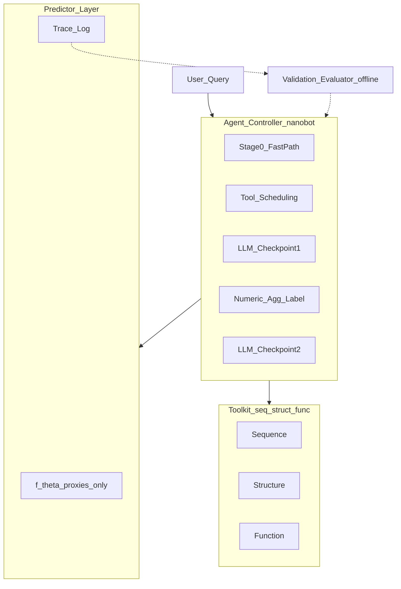

# RNA–RBP Agent 工程指南

本文为 `docs/` 目录下的唯一技术说明，涵盖 delivery 契约、应用层实现、端到端验收、编排模式对照、AlphaFold 3 运行时约束，以及 **§9 改动门禁**（锚定设计提案）。产品概述与安装入口见 [README.zh.md](../README.zh.md)。

**约束：** 运行时不得修改 `rhobind_agent_delivery/`。产品路径为 `Nanobot.run`（`rbp-agent agent|chat`）。改代码前先读 §9 改动门禁（设计提案为外部 Working Document，不强制入库）。

---

## 1. 分层与职责

本仓库交付单一应用；仓内 `nanobot/` 为插件源（source of truth, SoT），不作为独立产品入口，亦不并入 `rbp_agent/`。

| 层 | 职责 | 位置 |
|----|------|------|
| App | CLI、编排入口、delivery 桥接、config / workspace / artifacts | `rbp_agent/` → `rbp-agent` |
| SoT | skill 与 `tools/rbp`；由 setup / doctor 同步 | 仓内 `nanobot/` |
| Eval | runner、evaluator、LOO、evaluation plan、evolve-eval | `rbp_eval/` |
| Runtime | Nanobot 框架 | `$NANOBOT_SRC` |
| Science | 工具、数据库与 checkpoint（只读） | `$DELIVERY_ROOT` |

默认本地布局（可通过环境变量改写）：

```text
<BIO_ROOT>/
├── nanobot/                         # Runtime
├── nanobot-bio/                     # App
│   ├── rbp_agent/
│   ├── nanobot/                     # 插件 SoT
│   ├── rbp_eval/
│   ├── scripts/setup_all.sh
│   └── artifacts/
└── rhobind_agent_delivery/          # Science
```

| 组件 | 职责边界 |
|------|----------|
| Delivery | 无状态科学工具与知识库；不负责任务编排 |
| App | 控制流、融合策略、CLI / skill、SoT 同步 |
| Nanobot Runtime | Agent 循环、工具注册、会话 |

---

## 2. Delivery 契约

依据 delivery 侧 `DESIGN.md`、`HANDOFF.md`、`AGENT_BUILD_SPEC(.zh).md`、`SETUP.md` 与 `tools/README.md`。

### 2.1 科学问题与三阶段流程

目标问题：给定 RNA 与 RBP \(X\)，判定是否存在相互作用。当 \(X\) 不在已训练 head 集合中时：

1. **Retrieve** — 在已训练 panel 中检索相似 RBP（结构、序列、嵌入、结构域、功能）。
2. **Predict** — 以 donor 的 RhoBind head 对查询 RNA 打分，得到概率。
3. **Integrate** — 结合相似度与 LOO 校准先验，形成可解释判定。

LOO 经验结论：近亲存在时，最佳异头表现可接近自身头；ESM-C 余弦与迁移质量相关性较稳定；own-head AUPRC 较低的 donor 应降权；主要信号来自共享 encoder。

### 2.2 工具接口

- 双入口、同语义：CLI `python …/<name>.py --json '<payload>'`；Python `run(payload: dict) -> dict`。
- 权威目录：`agent/tools/registry.json`（含 `status`、schema 等）；仅 `status: ready` 可依赖。
- 标识：`{alias, uniprot}`；队列 `K562 | HepG2`。
- 共享类型：`RbpHit`、`Prediction`。
- 工具无状态；控制流、融合权重与自然语言推理由 App / LLM 负责。

### 2.3 运行时路径

Delivery 经 `tools/_common.py` 读取路径；跨主机部署须用环境变量覆盖。常用变量：

| 变量 | 含义 |
|------|------|
| `AGENT_DB` | 操作库根 |
| `RBP_REGISTRY` | `rbp_registry.json` |
| `EMB_BANK` / `FOLDSEEK_DB` / `SEQ_DB` / `PEAKS_DB` | 检索库 |
| `AFDB_DIR` / `RBP_PROTEINS` | 结构与参考序列 |
| `TRANSFER_DIR` | LOO transfer 先验 |
| `USALIGN` | US-align 可执行文件 |
| `RHOBIND_RELEASE` | RhoBind release 根 |
| `AF3_DIR` / `AF3_PARAMS` / `AF3_PYTHON` | 本地 AlphaFold 3 |

App 侧由 `DELIVERY_ROOT` 经 `apply_delivery_env()` 填充上表（见 §5）。

### 2.4 Conda 环境

| Env | 用途 |
|-----|------|
| `protein_embed` | Foldseek / USalign / ESM |
| `rna` | mmseqs 序列检索 |
| `rhobind` | `rhobind_predict` |
| `af3` | `structure_predict_af3`（经 `AF3_PYTHON`） |
| 通用 Python（+numpy） | resolve、功能查询、integrate 等轻量工具 |

安装：`source agent/setup.sh` 与 `bash agent/setup_envs.sh`，或 App 侧 `scripts/setup_all.sh`。

### 2.5 标准流水线

摘自 `AGENT_BUILD_SPEC` §4：

```text
resolve_rbp(query) -> {alias, uniprot, in_panel}
if in_panel:
    pred = rhobind_predict(..., rbps=[alias], cohort)
    return verdict(pred)

structure = structure_fetch | structure_predict_af3   # 可选
ann       = uniprot_annotation                        # 功能推理输入

hits_seq / hits_emb(ESM-C) / hits_struct / hits_dom
donors = fuse(...); abstain = confidence_abstain(...)

preds = rhobind_predict(rna, rbps=donor_aliases, cohort)
tprior / quality = transfer_prior_lookup / donor_quality_prior
score = similarity_weighted_vote(preds, hits, priors…)
verdict = LLM_integrate(evidence_table, score, abstain, ann)
```

LLM 触点：（1）功能推理（`uniprot_annotation` 等）；（2）最终整合。当 `abstain.confident == false` 时须降低结论强度。

### 2.6 工具分类（DESIGN）

| 类 | 代表工具 | 备注 |
|----|----------|------|
| A 结构 | `structure_fetch`、`structure_predict_af3`、Foldseek / USalign | AFDB 优先，AF3 为可选回退 |
| B 序列 | ESM、`domain_architecture`、mmseqs | ESM-C 为主要迁移信号之一 |
| C 功能 | UniProt / 文献 / GO-Pfam | 供 LLM 使用的结构化字段 |
| D 预测 | `rhobind_predict`、`rna_preprocess` | 包装 release，不复制权重 |
| E 整合 | vote / prior / abstain / donor_quality | LOO 校准 |

另有 `resolve_rbp`。状态以 `registry.json` 为准。

### 2.7 知识库与参考结果

- Panel：K562 约 118 head，HepG2 约 85；合并约 238 蛋白。
- `rbp_registry.json`：标识、注释与 val AUPRC（donor 质量先验）。
- Transfer：`database/transfer/loo_*.csv`。
- 参考烟测：`agent/examples/`；own-head 正例 RNA × PTBP1 约 0.966；全 test 集 own-head AUPRC 约 0.9311。

### 2.8 职责划分

| Delivery | App |
|----------|-----|
| 工具、registry、DB、checkpoint | Agent 循环、工具选择、融合权重 |
| 确定性 integrate 基线 | 功能推理与最终 verdict 文案 |
| `eval/` 协议与 LOO 参考 | val 上调参与自演进策略 |
| `setup.sh` / conda | 路径、产品 CLI、安全与交互 |

### 2.9 限制条件（BUILD_SPEC §9）

- Donor 须在所选 cohort 具有 head。
- 不同 metric 虽映射到 \([0,1]\)，尺度仍不一致，融合前需归一化。
- 网络工具可在离线场景跳过；AF3 耗时长且依赖 MSA/权重；`rna_blastn` 依赖 peaks DB。
- 单条 RNA 上单 donor 概率方差较大；迁移应视为多 donor 聚合效应。

---

## 3. 技术栈

### 3.1 Science

| 层 | 技术 |
|----|------|
| 预测 | RhoBind（PyTorch / transformers 等） |
| 嵌入 | ESM2 / ESM-C / SaProt |
| 结构 | Foldseek、US-align；可选 AlphaFold 3 |
| 序列 | mmseqs |
| 注释 | UniProt / RCSB / Europe PMC（`network: true`） |
| 接口 | CLI `--json` 与 `run()`；conda 隔离 |

### 3.2 App

| 层 | 技术 |
|----|------|
| 运行时 | Python ≥ 3.10；[HKUDS/nanobot](https://github.com/HKUDS/nanobot) |
| 包 | `rbp_agent`；入口 `rbp-agent` |
| 编排 | `Nanobot.run` + skill + ToolRegistry |
| LLM | 多厂商；`rbp-agent onboard` → `~/.nanobot/config.json` |
| 桥接 | `DeliveryToolClient` + `SCRIPT_MAP` |
| 产物 | `artifacts/{traces,sessions,reports,cache,logs,diag}` |

### 3.3 插件覆盖层

```text
nanobot-bio/
  nanobot/skills/rbp-agent/SKILL.md
  nanobot/agent/tools/rbp/*.py
  rbp_eval/
  rbp_agent/
```

由 `python -m rbp_agent.sync_overlay` 同步至 `$NANOBOT_SRC`。检查：`rbp-agent layout`。

---

## 4. App 侧实现对照

实现位于 `nanobot-bio`，不修改 delivery 源码。

### 4.1 桥接

| 模块 | 职责 |
|------|------|
| `env.py` | `DELIVERY_ROOT` 与路径注入 |
| `client.py` | conda 选择与子进程调用 |
| `registry.py` | Nanobot Tool 注册与 payload 归一化 |
| `mapping.yaml` | 工具名 ↔ 脚本相对路径 |
| `nanobot/…/tools/rbp/*` | LLM 可见工具封装 |

原则：透传 delivery schema；失败返回 envelope；`p_hat` 仅来自 predict。

### 4.2 编排与 BUILD_SPEC

| BUILD_SPEC | 实现 |
|------------|------|
| in_panel → own-head | Stage 0：`resolve_rbp` → `predict_interaction`（一次）→ JSON → 终止 |
| 新 RBP → 多轴检索 | Stage 1：序列 / 结构域 / 可选结构 / 功能 / RNA 相似度 |
| donor 预测 | Stage 2：`predict_interaction` |
| integrate | Stage 3：vote / prior / abstain + evidence → JSON |
| 金标 | `own-head` / `agent --example pos` ≈ 0.966 |

入口：`integrate.py`（`RBPAgent`）、`cli.py`。

### 4.3 Skill 与安全默认

`SKILL.md` 规定：最终输出为单一 JSON；标签阈值 Strong≥0.75、Likely≥0.50、Unlikely≥0.25；预测失败则 `p_hat=null`、`confidence=low`；禁用 shell / 通用网络工具；transfer 候选 \(N_{\mathrm{cand}} \le 5\)，融合相似度低于 0.30 丢弃。

### 4.4 路径与产物

- 包根：`NANOBOT_BIO_ROOT`（默认本仓）。
- 产物：`rbp_agent/core/paths.py` → `artifacts/`。
- 迁移 delivery：优先改 `DELIVERY_ROOT`；包内相对路径变更时同步 `SCRIPT_MAP` / `mapping.yaml`。

### 4.5 自演进与评测

| 优化项 | Delivery 期望 | App 实现 | 状态 |
|--------|---------------|----------|------|
| `fusion_weights` | LOO val 调权 | `retune_weights` → evolve → promote | 已实现 |
| `abstain_thresholds` | OOD / abstain | `retune_abstain_thresholds` | 已实现 |
| `label_thresholds` | 四级标签校准 | `retune_label_thresholds`（需标签） | 已实现；无标签则跳过 |
| Toolkit 扩展 | registry 增删 | 仅人工审阅提案 | 不自动改 delivery |
| Proxy cache | 跳过重复 Stage-1 | `proxy_map.json` | 已实现 |
| Heavy LOO | 全 FASTA 重算 | — | 延期；现用 CSV lookup |

| 命令 | 产物 |
|------|------|
| `python -m rbp_eval.loo_eval` | `eval_loo_report.*` |
| `rbp-agent eval-plan` | `evaluation_plan_report.*` |
| `rbp-agent evolve` | `evolved.candidate.yaml`、`self_evolution_report.json` |
| `rbp-agent evolve-eval` | `evolve_eval_report.*`（nested split） |
| `rbp-agent promote-evolved` | `evolved.yaml`（`evolved: true`） |

### 4.6 安装

```bash
export BIO_ROOT=/path/to/workspace
bash $BIO_ROOT/nanobot-bio/scripts/setup_all.sh
source $BIO_ROOT/nanobot-bio/.venv/bin/activate
rbp-agent doctor && rbp-agent chat
```

`setup_all.sh` 为唯一安装入口（含 runtime 检查、AF3 状态记录、SoT sync）。

### 4.7 实现状态摘要

| Delivery 要求 | App 落地 |
|---------------|----------|
| JSON 工具发现 / 调用 | `DeliveryToolClient` |
| Stage 0 / Transfer | Skill Stage 0–3 |
| 环境变量换机 | `.env` + `apply_delivery_env` |
| 不改 delivery | compliance / MVP 检查 |
| Val / 自演进 | 轻量已实现；重型 LOO 延期 |
| AF3 | 桥接已接；本机兼容性见 §8 |

---

## 5. 路径迁移

```bash
export BIO_ROOT=/new/workspace
export DELIVERY_ROOT=/new/path/to/rhobind_agent_delivery
source $BIO_ROOT/nanobot-bio/.venv/bin/activate
rbp-agent doctor
```

- 整包迁移：设置 `DELIVERY_ROOT`。
- 拆分 DB / release：再设 `AGENT_DB`、`RHOBIND_RELEASE` 等。
- 包内脚本相对路径变更：更新 `SCRIPT_MAP` / `mapping.yaml`。

默认发现 `$BIO_ROOT/rhobind_agent_delivery`；缺失时抛出 `FileNotFoundError`。Runtime 使用 `NANOBOT_SRC`。

---

## 6. 端到端验收

需激活 `.venv`。若存在 delivery LOO CSV，`rbp-agent gate` 将执行 light eval。

### 6.1 工程门禁

```bash
bash scripts/check_secrets.sh
rbp-agent gate
rbp-agent gate --skip-eval   # 公开 CI 等价
```

通过条件：ruff、pytest、layout 成功；有 delivery 时生成 `eval_loo_report.json` 与 `evaluation_plan_report.json`（`n≥10`）。GitHub Actions 使用 skip-eval 路径。

### 6.2 路径与 layout

产物位于 `artifacts/`。`workspace/skills/` 为 sync 副本，不应手改。

```bash
python -c "from rbp_agent.core.paths import ensure_artifact_dirs; print(ensure_artifact_dirs())"
rbp-agent layout
```

### 6.3 Doctor

```bash
rbp-agent doctor
```

检查 `resolve_rbp(PTBP1)`、HF / conda 配置，并写入 `doctor_report.json`；ESM probe 记录成功或失败原因。

### 6.4 Own-head

```bash
rbp-agent own-head
rbp-agent agent --example pos --strict
```

正例 own-head 参考概率约 0.966（不经 LLM）。

### 6.5 结构轴回退

有 AFDB 时应优先 `structure_fetch` / `struct_similarity`。无结构时 `predict_structure` 至多一次；失败写入 `artifacts/cache/structure/`，不得记为相似度 0。见 §8。

### 6.6 Transfer / 暗蛋白表述

- 无 LOO prior：`prior_missing` 且 `confidence=low`。
- explanation 须说明计算结果不能替代 CLIP/eCLIP。
- transfer 结果仅作筛查，不作实验替代。

### 6.7 Light LOO

对不少于 10 个 held-out panel RBP，以 domain（可选序列）选 donor，查 CSV transfer AUPRC；不重跑 RhoBind。

```bash
python -m rbp_eval.loo_eval --out artifacts/reports/eval_loo_report.json
```

验收：`n≥10`，含 own vs policy、均值与 failures。全量 force-transfer 重算延期。

### 6.8 Evaluation Plan

```bash
rbp-agent eval-plan
rbp-agent eval-plan --with-seq
rbp-agent eval-plan --labels path/to/scored_labels.json
```

产出 `evaluation_plan_report.*` 与 `faithfulness_rating_sheet.csv`。Strata 标签：`own_head`、`in_panel_transfer`、`dark_protein`、`cross_kingdom`（非 CI 硬失败）。暗蛋白 / 跨界场景应满足 Stage-3 checklist 失败项不少于 2，从而 `confidence=low`。

### 6.9 自演进

```bash
rbp-agent evolve
rbp-agent gate
rbp-agent promote-evolved
```

仅 `evolved: true` 时加载 live 配置。Toolkit 扩展保持人工审阅。

### 6.10 自演进评测（nested split）

在 promote 前比较 defaults 与 retuned 在 held-out 半集上的表现：

```bash
rbp-agent evolve
rbp-agent gate
rbp-agent evolve-eval --tier-a-ok true
```

报告：`evolve_eval_report.*`。建议规则：工程门禁通过且 `delta_auprc > 0` 时可考虑 promote；否则保持 candidate。指标仍为 CSV lookup，非实例级 RhoBind 重算。

### 6.11 命令摘要

```bash
rbp-agent doctor | mvp | layout | compliance
rbp-agent eval-plan | evolve | evolve-eval
python -m rbp_eval.loo_eval
```

### 6.12 常见运行时失败

| 现象 | 解释 |
|------|------|
| `rc=-9` / `p_hat=null` | 进程被 OOM killer 终止；RhoBind/ESM 通常需要数 GiB 以上可用内存 |
| AF3 失败 | 走 AFDB / 序列–结构域路径；不得将失败映射为相似度 0 |
| 密钥泄露 | 勿提交 `.env` 或 `~/.nanobot/config.json`；泄露后轮换密钥 |

---

## 7. 编排模式对照

下列模式来自成熟开源 Agent 系统的共性抽象，本仓库不引入对应框架依赖。

| 模式 | 本仓映射 |
|------|----------|
| Playbook / tools / backends 分离 | SoT skill + tools + delivery |
| 注册表工具 | `SCRIPT_MAP`、白名单、插件 tools |
| 类型化 I/O；数值由工具产生 | bridge 信封；`p_hat` 仅来自 predict |
| 离线编译式策略更新 | evolve → candidate → promote |
| Memory 与 artifacts 分离 | `proxy_map` / `evolved.yaml` vs `artifacts/` |
| 结构化 traces | `trace_schema` |
| Stage / 轴门控 | `STAGE_TOOL_SETS`、axes |
| 评测后晋升 | light LOO / eval-plan asserts |

未采用：LangGraph/CrewAI 作为依赖、以 MCP 直接驱动 RhoBind、在线改权重、自动修改 delivery registry。

### 7.1 相关工作与本系统对应关系

| 主题 | 映射 |
|------|------|
| ChemCrow / CRISPR-GPT / Cell AI-agents | 工具产出数值；分阶段编排；评测门禁 |
| Virtual Lab（critic） | Stage-3 evidence checklist |
| Coscientist | 离线实验闭环，非在线自改 |
| RNA-FM 及相关 RNA LM | `rna_similarity`；fusion 键 `rna_embed` |
| AlphaFold 3 | AFDB 优先；AF3 环境独立升级（§8） |

---

## 8. AlphaFold 3 运行时

本机观测（记录于 `.af3_status`）：

| 项 | 值 |
|----|-----|
| GPU | RTX 5090 D，compute capability 12.0 |
| 环境 | `jax==0.4.34`，`triton==3.1.0` |
| 失败模式 | Triton 不支持该 compute capability（全量推理） |
| 状态 | 升级延期（磁盘不足以安全 clone 回滚环境） |

建议升级路径（不改 delivery）：`jax==0.6` 与 `triton==3.3`（参见 alphafold3 社区讨论 #394）；烟测通过后再更新 `AF3_PYTHON`，并清理 `artifacts/cache/structure/`。

AF3 不可用时路径：AFDB → Foldseek → 序列 / 结构域；结构失败不得记为相似度 0；对暗蛋白与跨界查询保持 `confidence=low`。解释文本仅引用工具返回的置信度字段（如 `mean_plddt`、`region_plddt`、`ptm`）。

---

## 9. 改动门禁（Proposal × 成熟项目惯例）

本节约束对本仓库的一切结构 / 功能 / 文档改动。Cursor Rule：仓根 `.cursor/rules/nanobot-bio-change-gates.mdc`。

### 9.1 权威来源（优先级）

| 优先级 | 来源 | 说明 |
|--------|------|------|
| P0 | 外部设计提案（Internal Working Document，2026-07-09，§1–§11） | 语义权威；**不强制**随仓分发 PDF/DOCX |
| P0 | 本文 §9 / §9.10 | 可执行门禁与路径约定 |
| P1 | Implementation-Ready 展开（mermaid / 严格 JSON / `caveats` / `confidence` float 偏好） | 不得削弱 Proposal 硬约束 |
| P2 | Delivery `HANDOFF` / `AGENT_BUILD_SPEC` | 只读科学桥、conda、I/O |
| P3 | ≥20 成熟开源惯例（见 §9.8） | 分层 / CI / 可复现；不引入为依赖 |
| — | 聊天口头约定 | **无效**，不得覆盖以上 |

### 9.2 系统目标与输出（Proposal §1–§2）

关闭目录上的 $f_\theta(\mathrm{RNA},\mathrm{RBP})\to[0,1]$ 不直接扩展到未见 RBP。路径：多视角检索 proxy → 在 proxy 上调用 $f_\theta$ → LLM 融合 → 四级可解释 verdict。

**MUST NEVER** 对未见蛋白直接调用预测器；仅经代理。

输出为严格 JSON（字段名固定）：

```json
{
  "label": "Strong|Likely|Unlikely|No",
  "p_hat": 0.0,
  "confidence": 0.0,
  "explanation": "3-5 sentences grounded in tool outputs",
  "supporting_rbps": [
    {
      "rbp_id": "P12345",
      "similarity_score": 0.78,
      "similarity_breakdown": {"seq": 0.82, "struct": 0.61, "func": 0.85},
      "prob": 0.84,
      "confidence": 0.91,
      "rationale": "..."
    }
  ],
  "caveats": ["optional"]
}
```

规范偏好 `confidence` 为 float；现仓亦接受 `high|medium|low`（见 §9.7）。`explanation` 必须 grounded；`caveats` 可选但 Stage 3 须能显式 surfacing。

### 9.3 架构（Proposal §3）



三层职责固定。§3.2：必须用 Agent（自由文本功能融合 + 有据解释），禁止把固定 batch pipeline 当作产品面。产品入口：`Nanobot.run`（`rbp-agent agent|chat`）。

### 9.4 四阶段工作流（Proposal §4）

| Stage | MUST |
|-------|------|
| 0 | UniProt 严格匹配 → own-head `predict_interaction` 后 STOP；identity ≥95% → near-known Fast Path 且 explanation 标明；否则 Stage 1 |
| 1 | seq / struct / func 并发；$N_{\mathrm{cand}}≤5$；fused similarity $<\tau_{\mathrm{drop}}=0.30$ 必须丢弃；LLM Checkpoint 1 |
| 2 | 仅对幸存 proxy 调 $f_\theta$；可批处理 |
| 3 | 确定性加权 $\hat{p}=\sum s_i p_i c_i/\sum s_i c_i$；阈值 Strong≥0.75 / Likely≥0.50 / Unlikely≥0.25 / No；LLM Checkpoint 2 出完整 JSON |

`p_hat` / `prob` **仅**来自预测工具；OOM/超时 → `p_hat=null`，禁止 LLM 臆造概率。

### 9.5 工具与 nanobot 布局（Proposal §5–§6）

- Tool 契约：JSON Schema、`async execute`、失败 `{"status":"error","reason":...}`（禁止抛穿）、信封含 `latency_ms`、`read_only` / `concurrency_safe`。
- 优先级：P0 `predict_interaction` / `get_known_rbp_list` / `seq_similarity` → P1 `struct_similarity` / `get_func_annotation` → P2 `predict_structure` / `literature_search`。新增工具须先更新 schema / 登记表 / 测试。
- UniProt 寻址；AF3/literature 按 `(target_uniprot, tool)` memoize；结构失败 → 序列-only，**MUST NOT** 记相似度 0。
- Proposal §6.2 目标布局：

```text
nanobot-bio/
├── nanobot/skills/rbp-agent/SKILL.md
├── agent/tools/rbp/   # predict, catalogue, seq, structure, annotation, common
└── rbp_eval/
```

- **过渡编辑点（现状）：** `nanobot/agent/tools/rbp/`（见 §9.7）。Skill SoT：`nanobot/skills/rbp-agent/SKILL.md`。禁止再造第三棵工具树。

### 9.6 自演化、默认值、评估与风险（Proposal §7–§11）

- 自演化 **MUST** 离线：Trace → attribution → weight/threshold retune；（扩展）toolkit 建议与 cache promotion 须人工审核。**MUST NOT** 在线改权重或改 delivery registry。
- Promote：**MUST** 工程门禁 + 评测证据（本仓约定：nested-split `delta_auprc > 0`；否则 HOLD）。
- Table 3 默认（`n_cand=5`、`tau_drop=0.30`、near-match 95%、四级阈值、框架 nanobot）无 eval 证据 **禁止**擅自修改；改则同步 `config/defaults.yaml` 与 `tests/test_proposal_compliance.py`。
- 评估：held-out split；AUROC/AUPRC/ECE；消融（单视角 / 固定 vs LLM 融合 / 无 Stage3 解释 / $N_{\mathrm{cand}}\in\{1,3,5,10\}$）；faithfulness×30。宣称科学提升 **MUST** 附 `eval-plan` / `evolve-eval` 报告路径。
- 风险：外推 → 低置信 + explanation 明示；幻觉相似度 → 暴露 `similarity_breakdown`；AF3 → 预缓存 + 硬超时 + 序列回退。

### 9.7 已知偏差登记（禁止无证据扩大）

| Proposal / IR | 现状 | 门禁态度 |
|---------------|------|----------|
| §6.2 `agent/tools/rbp` 在仓根 | `nanobot/agent/tools/rbp/` | 已登记偏差；本轮可继续在此编辑；迁移须另开任务并更新 layout |
| `confidence` 偏好 float | SKILL 主用 `high\|medium\|low`，schema 兼 float | 允许双表示；统一为 float 须同 PR 改 schema+SKILL+测试 |
| `caveats` | `verdict_schema` 可选字段 | 对齐 |
| Table 2 外工具 | delivery 桥接（resolve、integrate、abstain 等） | 允许；P0–P2 逻辑名必须在注册表 |
| Checkpoint 1 | 确定性 `fuse_*` + LLM | 允许基线；禁止删除两处 LLM checkpoint 语义 |
| 完整 ECE / 全消融 | light eval-plan / evolve-eval | 宣称达标须有报告 |

### 9.8 成熟项目惯例对照（≥20，不引入依赖）

| 惯例 | 参考 | 本仓落点 |
|------|------|----------|
| 分析层 / 数据层分离 | Scanpy, AnnData | App ≠ Science；禁止改 delivery |
| 序列 / 结构工具链 | Biopython, AlphaFold, fair-esm, OpenMM, RDKit | 数值经 toolkit / predictor 信封 |
| 模型 I/O 与缓存 | HF Transformers, PyTorch, Lightning | 长耗时 memoize；失败 envelope |
| 类型化契约 | Pydantic, FastAPI | Tool JSON Schema；verdict 字段固定 |
| CI 小而硬 | pytest, ruff | 改后至少跑 proposal compliance |
| 可复现工作流 | Nextflow, Snakemake | conda 按工具；产物进 `artifacts/` |
| Agent 编排 | OpenHands, Haystack, DSPy | `Nanobot.run`；离线 evolve |
| 包 / 文档卫生 | pyOpenSci | 单一 SoT；深度文档仅本文 |
| 运行时宿主 | HKUDS/nanobot | skill + Tool 覆盖层 |
| 领域 agent 模式 | ChemCrow / Virtual Lab / Coscientist 类 | 两处 checkpoint；有据解释；离线闭环 |

### 9.9 改前五问与改后必跑

改前：

1. 是否触及 `rhobind_agent_delivery/`？（是 → 停止）
2. 是否改变 Stage 0–3 / 两处 LLM /「未见禁 own-head」语义？
3. 是否改 Table 3 默认或 fusion 轴？（是 → 要 eval 证据）
4. 工具名是否同步 whitelist / `SCRIPT_MAP` / mapping / SKILL？
5. 是否只改了 workspace 副本而非 `nanobot/` SoT？

改后：

```bash
pytest tests/test_proposal_compliance.py
rbp-agent layout   # 或 scripts/ci_gate 中的 layout 步骤
# 若改权重 / 阈值 / 工具策略：
rbp-agent evolve-eval   # 或 eval-plan；附报告路径
```

### 9.10 自研模型与 nanobot SDK 边界

原则：**唯一 Agent 框架 = nanobot SDK**；自研/领域模型（RhoBind、ESM、AF3、RNA-FM）仅通过原生 `Tool` + 子进程/本地 backend 暴露，不在 LLM 进程加载科学权重。

| SDK 能力 | 本仓用法 |
|----------|----------|
| `Nanobot.from_config` / `run` / `run_streamed` | 产品入口；评测可用 `ephemeral=True` |
| `Tool` + `read_only` | Stage 1 多视角并行；由 runner `asyncio.gather` |
| `AgentHook` | `rbp_eval.nanobot_hooks` / offline `JsonlTraceHook` |
| `RunResult.tools_used` / `usage` | `AgentResult` 透传 |
| `sessions` / `memory` | 长对话；勿另造会话库 |

路径约定（减少副本）：

| 用途 | 路径 |
|------|------|
| Skill / tools SoT | `nanobot/skills/`、`nanobot/agent/tools/rbp/` |
| Workspace skill | symlink → SoT（`sync_overlay`） |
| 配置（含 `models:`） | `config/defaults.yaml` |
| ESM 领域缓存 | `artifacts/cache/esm/` |

准确度相关默认：`fusion_weights.rna_embed` / `rna_fm` 在 mock 下为 `0`；`normalize_verdict` 在 checklist 失败项 ≥2 时强制 `confidence=low`。doctor 写 `artifacts/reports/model_capability_matrix.json`。

禁止：平行 `_proposal_sot` 树；`rbp_eval.fusion` 再导出；把 RhoBind 仅为「多用 SDK」而 MCP 化；引入 LangGraph/CrewAI 为产品依赖。

---

## 10. 文献与文档索引

### Delivery（`$DELIVERY_ROOT/agent/`，只读）

| 文档 | 内容 |
|------|------|
| `HANDOFF.md` | 交接说明 |
| `DESIGN.md` | Packaging Plan |
| `AGENT_BUILD_SPEC.md` | 调用约定与 caveats |
| `SETUP.md` | Bundle 与 conda |
| `eval/README.md` | LOO 协议 |
| `tools/structure/AF3_SETUP.md` | AF3 安装 |

### App

| 文档 | 内容 |
|------|------|
| 本文 §1–§8 | 契约、验收、编排对照、AF3 |
| 本文 §9 | 改动门禁 |
| 外部设计提案 | Project Proposal（不随仓强制分发） |
| `README.zh.md` | 产品概述与 CLI |
| `nanobot/skills/rbp-agent/SKILL.md` | Stage 0–3 playbook |
| `CHANGELOG.md` | 版本记录 |

---

## 11. 小结

App（`rbp_agent` 与 SoT 同步）经 Nanobot Runtime 编排，并通过 `DeliveryToolClient` 只读调用 Science 包。目录内 RBP 走 Stage 0 own-head；未见 RBP 走 retrieve → predict → integrate。相互作用概率等数值仅来自工具输出。后续改动须遵守 §9 门禁。
